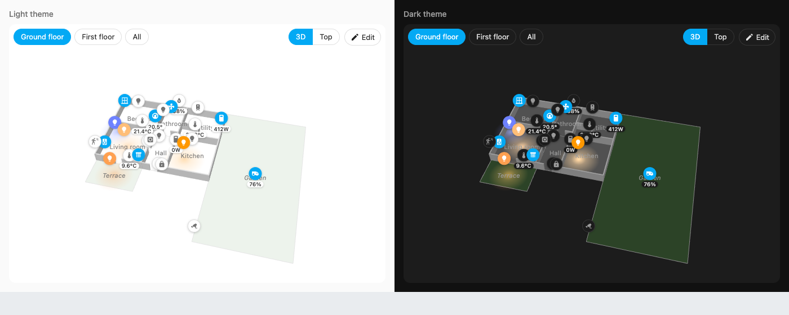
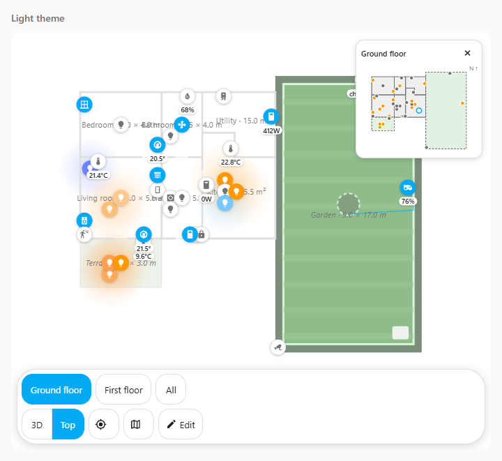
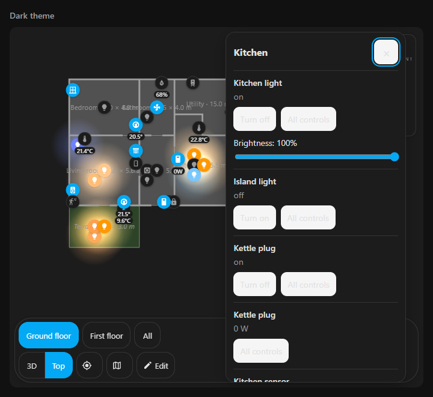
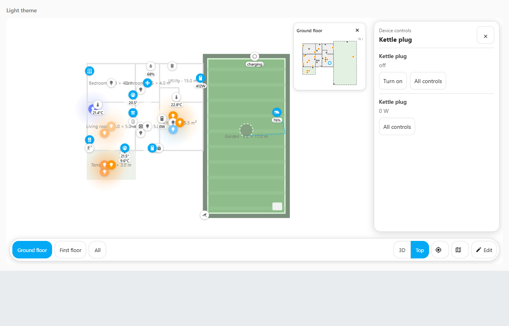
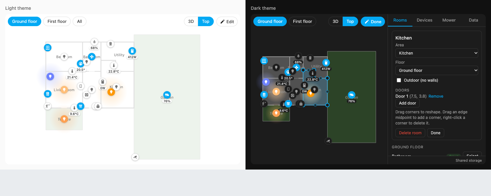
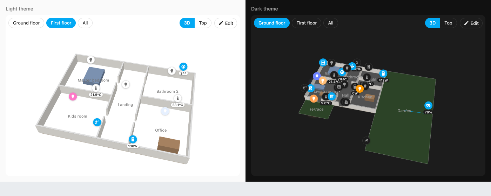

# Taylor's 3D

NOTICE: Based on floorplan3d-card by istals (MIT)

For entity choices, missing floors and saved-link warnings, see the
[Home Assistant links guide](docs/HOME-ASSISTANT-LINKS-GUIDE.md).

Original project by Ingus Stals / istals. This independent copy is maintained by Taylor.

The features below describe this source version. Use a matching verified release,
or build the source yourself: an older HACS release can contain fewer features.
The feature log records the checks and installation packages for each checkpoint.
The Phase 20 `0.2.0` version is a tested local candidate with its own
installation ZIP. Its checks and remaining Home Assistant tests are in the
[feature log](REQUIREMENTS_AND_FEATURES.md#phase-20-020-local-checkpoint).
Local checks alone do not publish a HACS update.

This `0.4.0` development source adds six improvements to the inside-card builder
and House layout: room sheets with Summary/Controls/Details, pictured icon and
friendly-name pickers, five simpler editing sections and guided setup, optional
four/five-button favourites with More, readable themes and clearer save/action
messages. The [UI polish guide](docs/UI-POLISH.md) explains each change and gives
a practical Home Assistant test. The earlier `0.2.0` and `0.3.0` packages remain
separate checkpoints; this work does not publish a HACS update.

The earlier local package is **`taylors3d-phase22-ui-polish-local-candidate.zip`**.
Its complete unit checks, qualified 36-program browser coverage and independent
installation-ZIP audit pass. The [feature log](REQUIREMENTS_AND_FEATURES.md#phase-22-040-ui-polish)
records the exact build/package checksums and the household checks still to do.

The 7 October usability follow-up adds room/device overlays that keep the house
viewport unchanged, custom left-menu bars, explicit draft-leave choices and
model replacement review. Its current checks and test package are listed in the
[usability review](docs/UI-REVIEW.md). Earlier package evidence is not a rerun of
this follow-up build.

The current appearance follow-up applies a quiet black-and-white glass style
across Taylor's 3D: floating controls, room popups, the mini-map, custom bars and
readable solid settings. It supports both House and standard layouts and keeps
real light colours, alerts and your custom button colours. See the
[glass appearance guide](docs/GLASS-APPEARANCE-GUIDE.md) for simple setup and
testing steps. Earlier packages above predate this visual change; use a matching
verified build rather than treating their checks as current glass-style evidence.

The latest approved source changes make busy houses easier to use: **Rooms**,
**Important activity** and **All devices** display choices, a customisable House
menu with a clear phone **More** button, and **Search** across rooms, devices,
scenes, saved views and in-card settings. Crowded room labels move into a compact
Rooms chooser. Read the [simple navigation guide](docs/SMART-NAVIGATION-GUIDE.md)
for the controls and how to save your choices. The feature log tracks the final
checks and Git delivery; earlier installation ZIPs do not contain this work.
Recent activity and an extra Glass effects switch remain future ideas.

To try the House interface in Home Assistant, open this card's visual settings and choose
**Appearance → Card layout → House with navigation and room panels**, then
**Appearance → Card colours → Dark glass**, **Light glass** or **Home Assistant colours**. New HA cards start in House;
existing cards keep the standard layout until you select it. The standalone
browser demo starts in the standard layout and does not include HA's visual-settings editor.
The [House layout guide](docs/HOUSE-VIEW-GUIDE.md#choose-the-layout) shows the steps.

The [custom controls guide](docs/CUSTOM-BUTTONS-AND-BARS.md) covers the original
builder, saved action links, dragging and the real-device checks that still apply.

See [Requirements and features](REQUIREMENTS_AND_FEATURES.md) for Taylor's development ideas, proposed build order and progress log.
See the [plain-language controls guide](docs/FEATURES-GUIDE.md) for camera automations, Undo/Redo and room overlays.
See the [camera guide](docs/CAMERAS-GUIDE.md) for camera pictures and approximate coverage.
See the [tracking guide](docs/TRACKING-GUIDE.md) for room activity, parked vehicles and measured vacuum positions.
See the [security and weather guide](docs/SECURITY-AND-WEATHER-GUIDE.md) for contacts, explicit door hinges and outdoor effects.
See the [lighting guide](docs/LIGHTING-GUIDE.md) for Hue colour, warm/cool white and the realtime light budget.
See the [model shading guide](docs/MODEL-SHADING-GUIDE.md) for lighter display settings and preparing AO textures in Blender.
See the [scene preview guide](docs/SCENE-PREVIEW-GUIDE.md) to try a lighting look before deliberately activating its Home Assistant scene.
See the [idle mode guide](docs/AMBIENT-IDLE-GUIDE.md) for optional gentle rotation and picture dimming on a wall panel.
See the [House layout guide](docs/HOUSE-VIEW-GUIDE.md) for the photo-inspired menus, actual status sources and responsive room panels.
See the [furniture guide](docs/FURNITURE-GUIDE.md) for local licensed packs, placement drafts and the pack-making tool.
See the [visual settings guide](docs/VISUAL-SETTINGS-GUIDE.md) for card options, imported overrides and advanced layout controls.
See the [complete dashboard backup guide](docs/DASHBOARD-BACKUP-GUIDE.md) for the local candidate's separate inspect, prepare and new-dashboard steps.
See the [translation guide](docs/TRANSLATION-GUIDE.md) for supported languages, literal source data and how to add translated feature labels.
See the [room and device controls guide](docs/ROOM-AND-DEVICE-CONTROLS-GUIDE.md) for room shortcuts, supported direct controls and mini-map alerts in the local candidate.

A Lovelace card that shows your home as a 3D floorplan with every device on it. Draw each room
once and link it to a Home Assistant area. After that, every device assigned to the area appears
in the room by itself, placed by type: lights on the ceiling, door sensors by the door, other
sensors on the walls. Drag any of them to its exact spot. Also shows a robot mower's live
position over its map.



- Floors from Home Assistant, a chip per floor plus "All", 3D and north-up top view; with a
  3D model the chips are the model's views (Exterior, Ground floor, …), linked to HA floors
- Bottom bubble bar for saved views, 3D/Top, reset, section, day/night, mini-map and Edit.
  Choose the buttons and their order in the visual card editor
- Rooms, Important activity or All devices marker display; current room summaries
  reveal devices when selected, with a compact room chooser when labels would overlap
- House menu sections can be hidden and reordered in the visual card editor.
  Phones show three/four sections plus More; wider cards retain the left rail
- Search friendly names and entity IDs across rooms, devices, scenes, views and
  in-card settings. Search opens controls; it does not operate a device or run a scene
- Custom named button bars below the house, in an optional left menu or in one exact room panel. Use Edit →
  Controls → Buttons and bars to choose labels, pictured icons, colours and actions, drag them into
  order, and save one layout change with Undo/Redo. Link existing scenes, scripts,
  automations, camera views, supported device toggles and Home Assistant controls.
  Optional four/five-button favourites keep other actions under More. Search by
  friendly name, duplicate a button, or start from a template and select your own routine
- Tap a room to open its devices and readings; tap a device for quick controls. **All controls**
  opens Home Assistant's full options for that entity. Long-press opens more-info; the original
  single-tap toggle behavior is still available as a visual setting
- Lightweight north-up 2D mini-map with a floor selector, live device dots and camera focus;
  tap a room or dot to move the main view there
- Light panels offer brightness, colour and warm/cool white when the entity reports that support.
  Controls send deliberate commands; the displayed state follows Home Assistant's response
- Valid on lights cast a floor glow and illuminate model surfaces in their reported colour/brightness.
  Unavailable, restored, invalid and zero-output readings remain dark
- Markers show a value next to the icon (temperature, power, …)
- Camera controls use Home Assistant's native muted camera viewer. Edit → Devices → Advanced tools → Cameras saves
  approximate coverage with an explicit heading, viewing angle and range
- Device names, hidden/disabled choices, areas and sensor precision follow Home Assistant's
  metadata. Edit → Data reports missing saved links; model links keep their IDs for deliberate repair
- Edit → Devices → Advanced tools → Tracking connects explicit room observations, driveway vehicle sources and vacuum
  status/coordinates to their locations. Tracked symbols appear in 3D and on the mini-map;
  tapping opens their actual controls. Motion stays anonymous, recent sightings expire,
  and a cleaning state alone does not invent a vacuum route
- Measured vacuum sources can be calibrated visually with real source/plan point pairs.
  Status and position can have separate explicit timestamp/maximum-age rules
- Edit → Devices → Advanced tools → Security links real contacts to exact model objects, with optional owned outlines
  and explicitly configured rigid door motion. Unknown readings remain uncertain
- Edit → Appearance → Advanced tools → Environment chooses current HA weather for bounded outdoor rain/snow/cloud effects.
  Complete indoor outlines protect the house; static/low quality supports wall panels
- Edit → House → Model saves Normal, No realtime shadows or Authored shading (lamps off).
  Existing model materials stay intact; the material report checks actual textures and UVs.
  These display choices leave real light states and controls available
- Edit → Controls → Scenes saves explicit light previews such as Movie or Bedtime. The bottom bar
  offers Preview, Stop and a separate Activate action. Previews change the model lights;
  actual Home Assistant readings and device controls stay current
- Edit → Appearance → Advanced tools → Idle sets an optional idle delay, gentle rotation and picture brightness.
  Actual sun readings or quiet hours in Home Assistant's time zone can dim the drawing;
  touch, menus, editing, alerts and camera flights take priority
- Edit → House → Model → Wall presentation saves exact wall selections with normal, faded,
  glass-like or cut-away appearance. Camera-side walls can expose the interior;
  authored materials and manual Section remain available. See the [wall guide](docs/WALL-PRESENTATION-GUIDE.md)
- Edit → House → Model → Floor presentation separates up to four explicitly linked floors
  side by side or into stacked layers. The tested Phase 20 local candidate optionally gives
  horizontal floors separate panels: columns on wide scenes, stacked pictures on
  phones, with linked orbit/pan/zoom and the same renderer/light pool. For a GLB,
  use Edit → Controls → Views → Linked HA floors to allow the intended floors in All or your
  overview, then choose that view. Panels respect its existing visibility rules.
  Real positions, calibrations and the mini-map keep their source coordinates.
  Local checks pass; actual HA/model/panel checks remain. See the [floor guide](docs/FLOOR-PRESENTATION-GUIDE.md)
- Edit mode for admins: draw rooms, doors, floors, pin and hide devices, import/export
- Five editing sections keep related tools together. Continue setup opens the real
  house upload, floor/room links and controls, then an explicit final Save
- A status strip shows unsaved changes, saving, saved, failure and connection state.
  An action request is separate from the device's actual reported state
- One layout shared by every user and device (stored by the companion integration)
- Robot mower: live position, trail, map image or camera overlay, point calibration
- Optional 3D model of the house (.glb) under the plan: views per storey (upper storeys and the
  roof hidden), click a part to hide it in a view, saved cameras, pick a room's outline from the
  model, and a Day / Night button for lighting
- Day / Night button cycles Auto, Day, Night (remembered per device). Auto follows `sun.sun`: the
  sun's light and shadows point where the real sun is (using the model's `north`), and the house
  darkens smoothly through dusk; without `sun.sun` it stays Day
- Sun and moon in the sky (3D view with a model): the sun where `sun.sun` puts it, the moon from
  your Home Assistant location (`latitude` / `longitude`) with its current phase, and faint cool
  moonlight on moonlit nights
- Model objects are the controls: lamps glow and really light rooms and the facade (night is dark,
  the lamps carry it), tap a lamp for controls, hold it for the existing object controls; the mower model
  drives on the plan, the dock, EV charger and climate units show their state. Objects bind to
  their entities from the model's suggestions without setup
- Follows the HA theme, light and dark

## Using the new navigation





The [clearer house and navigation guide](docs/SMART-NAVIGATION-GUIDE.md) covers
the new marker display, House menu and Search controls. The screenshots below
show earlier navigation checkpoints; current controls use the glass appearance.

The bubble bar sits below the house, with space reserved so it does not cover the plan.
View buttons follow the names/order saved under **Edit → Controls → Views**. On a narrow panel the bar
uses two rows, and long button lists scroll sideways.

Tap a room's floor in the main view to open its panel. Rooms need an outline and an HA area
link to show their devices. A GLB without usable room geometry can use drawn outlines; room
picking on the model works from its visible floor surfaces. Opening a panel does not send any
device command. On/off and supported light brightness are quick controls; cameras, covers,
heating, vacuums and other full options are reached through **All controls** in Home Assistant.
Missing or unavailable devices are shown clearly, and failed commands display an error.

The mini-map shows one floor at a time. Choose its floor when more than one is visible, then
tap a room, device dot or empty point to focus the main view. It shows room outlines and device
positions rather than a second rendering of the GLB. It hides while editing; its **×** or map
bubble hides it temporarily. The visual editor controls its saved visibility, size and corner.

Open the dashboard card's **Edit → Show visual editor → Navigation and device controls** to
choose the bubble buttons, reorder them, change the mini-map, or select **Quick toggle** for
the original device-tap behavior. Layout editing inside the card remains available to admins.

Room and device controls open over the right edge by default on wide screens.
The visual editor can choose a popup beside the device instead. Opening either
keeps the house drawing size and camera unchanged.
On a narrow card, **Summary**, **Controls** and **Details** change the room sheet's
size and content. Drag its handle between sizes, or focus the handle and use
arrow keys/Home/End. Details keeps the complete device list and Home Assistant's
All controls links reachable. The sheet overlays the unchanged house and scrolls internally.



**Edit → Controls → Views** names this browser for camera automations. **Edit → Appearance → Advanced tools → Overlays** assigns
temperature/power/energy sensors and smoke/leak/unlocked-door alerts to rooms. The edit panel
also has Undo/Redo for layout changes. Read the controls guide above for setup and limits.

The navigation delivery is tested with the mock HA preview. Testing with Taylor's actual
house model, Home Assistant and wall panel is tracked in [the feature log](REQUIREMENTS_AND_FEATURES.md).

## Install

The published checkpoint recorded in this repository is **v0.1.0**. To evaluate
the `0.4.0` development candidate, use a matching supplied testing ZIP or build
this source version. A local build does not upload a release to HACS. The feature
log records which checks and package belong to each checkpoint.

The repository is a Home Assistant integration that also serves the card, so one install
covers both. The integration stores the layout and makes it available to all users.

### Local 0.4 testing package

Use a package matched to the verified checkpoint in the
[feature log](REQUIREMENTS_AND_FEATURES.md). The earlier
`taylors3d-phase23-ui-review-local-candidate.zip` contains the usability review;
it does not contain the later glass design or the latest room/menu/search work.
HACS uses a published release; a source commit or Git push alone does not create
an installable HACS update.

1. Keep the previous installation package and export your layout/dashboard
   backup before changing the installed version.
2. Create `/config/custom_components/taylors3d/` if needed. Extract the testing
   ZIP's contents **directly into that folder**. `__init__.py`, `manifest.json`
   and the `frontend/` folder should be directly inside it, with no second
   nested `taylors3d/` folder.
3. Restart Home Assistant, then hard refresh the browser: **Ctrl+Shift+R** on
   Windows/Linux or **Cmd+Shift+R** on Mac. If Taylor's 3D has not been set up
   before, use **Settings → Devices & services → Add integration → Taylor's 3D**.
4. Add a test card and set its visual **Layout name** to `polish-test` before
   making plan edits. Follow the [UI test guide](docs/UI-POLISH.md).

This installation changes the integration/card program used by **every Taylor's
3D card in that HA instance**. A separate Layout name protects the saved plan
edits, not the installed program version. Keep the prior package and backups
available if you need to return to the earlier version.

### HACS

1. HACS → ⋮ → Custom repositories → add `https://github.com/gregtaylor1993/taylors-3d`,
   type **Integration**.
2. Search for **Taylor's 3D** in HACS and download it.
3. Restart Home Assistant.
4. Settings → Devices & services → **Add integration** → **Taylor's 3D** → Submit.
5. Hard refresh the browser: **Ctrl+Shift+R** on Windows/Linux or **Cmd+Shift+R** on Mac.

### Manual

1. Download `taylors3d.zip` from the [latest release](https://github.com/gregtaylor1993/taylors-3d/releases)
   and extract it to `/config/custom_components/taylors3d/`
   (or build it yourself: `npm ci && npm run build`, then copy `custom_components/taylors3d/`).
2. Restart, then Settings → Devices & services → Add integration → **Taylor's 3D**.

`taylors3d:` in `configuration.yaml` also works; it is imported as the integration entry.

The card is loaded on every dashboard automatically; you do not need to add a resource.
If you only want the card without the integration, add `taylors3d-card.js` from the release
as a dashboard resource (Settings → Dashboards → ⋮ → Resources, type JavaScript module). The
layout is then stored per user, or per browser on old HA versions; the Data tab says which.

## Add the card

Dashboard → Edit → Add card → search **Taylor's 3D** (or Manual: `type: custom:taylors3d-card`).
The options below can be set in the visual editor or in YAML.

| Option | Default | |
|---|---|---|
| `layout_key` | `default` | Name of the stored layout. Use different keys for different plans. |
| `height` | `520px` | Card height. |
| `group_by` | `device` | `device`: one marker per device. `entity`: one per entity. |
| `wall_height` | `1.0` | Height of the cut-away drawn walls in metres (rooms drawn on the card; a model is cut at its storey height instead). |
| `occlusion` | `true` | With a model: markers hidden behind a wall from the current camera angle are shown faint (25 %) and can't be tapped; in edit mode they stay half visible and draggable. Checked once the camera has been still for 150 ms; not in top view. `false` turns it off. |
| `merge` | `true` | With a model: static parts that share a room / zone / level / layer group and a material are merged into one mesh when the model loads (far fewer draw calls; Edit → House → Model shows "Draw calls: before → after"). Objects, glass and other transparent parts, `<room>_floor` pieces and parts named by a `node:` view rule stay separate. `false` keeps every part (reloads the model). |
| `sky_bodies` | `true` | With a model: sun and moon discs on a dome around the house with a compass ring (moon position and phase from the HA location) and faint moonlight at night. `false` hides the discs and the ring. |
| `view` | `3d` | Start in `3d` or `top` view. |
| `floor` | first floor with rooms | Floor id (or view id) to show first, or `all`. |
| `view_id` | | View to show first (with a model: a view id such as `ground`). Wins over `floor`. |
| `room_labels` | `size` | Room labels: `size` (name and size, e.g. `Office · 4.5 × 5.0 m`, or `m²` for other shapes), `name`, or `none`. |
| `zoom_to` | `center` | Zoom pivot: `center` zooms (and rotates) around the view's rotation centre, `cursor` zooms towards the mouse pointer. A view can override it (see Camera). |
| `views` | | Per-view overrides by view id (see Views). |
| `model` | | URL of a `.glb` model, e.g. `/local/house.glb`. |
| `model_position` | `[0, 0, 0]` | Model offset in plan metres `[east, north, up]`. |
| `model_rotation` | `0` | Model rotation in degrees, counter-clockwise. |
| `model_scale` | `1` | Model scale (e.g. `0.01` for a centimetre model). |
| `model_opacity` | `1` | Model opacity, `0`–`1`. |
| `lights` | `auto` | With a model: `auto` gives lit lamps real lights (at most 12, 4 with shadows); `off` keeps them glowing only (for weak tablets). |
| `model_floors` | auto | Which HA floor each model level belongs to, e.g. `{ground: floor1, attic: floor2}` (for a `model:` URL; uploads set it in the Model tab). |

## Set up the plan

Click **Edit** on the card (admins only). Related tools are grouped into five
sections. On a phone, choose the section from the dropdown above the tools.

| Section | Tools |
|---|---|
| House | Rooms, Model |
| Devices | Devices, Objects when the model has them; Advanced: Cameras, Tracking, Security, Mower |
| Controls | Buttons and bars, Views, Scenes |
| Appearance | House settings when using House layout, Furniture; Advanced: Overlays, Environment, Idle |
| Data | Shared-storage information, import/export and dashboard backup |

For a new house, **Continue setup** guides you through Upload house → Link
floors/rooms → Add devices/controls → Save. Upload your `.glb`, select the actual
Home Assistant floors and areas, and choose your real controls. You can choose
drawn rooms and add controls later deliberately. Finish an open feature draft
with Save or Cancel before moving to the next setup step. The final Save keeps
the layout in the current storage backend and closes setup after a successful
response. **Edit → Data** identifies that backend: the companion integration
shares the layout; fallback storage belongs to a user or browser. **Edit existing**
returns to the regular sections, and Continue setup resumes the current progress.



**Rooms.** Every HA area is listed as *drawn* or *missing*. Click **Draw** and click the
corners of the room on the plan. Points snap to 5 cm, to existing corners within 25 cm (so
neighbouring rooms share walls exactly), and line up with nearby corners. Click the first point
or press Enter to finish, Backspace removes the last point, Esc cancels.
With a model loaded, **Pick** takes the outline from the model instead: click the room's
floor. A tagged room is linked to the area directly; an untagged floor is traced and previewed,
then **Use this outline** or **Draw instead** (Esc cancels).
Select a room (click it, or **Select** in the list) to:
- drag its corners, drag an edge's middle handle to add a corner, right-click a corner to delete it
- **Add door**, then click on a wall
- change its area or floor, mark it **Outdoor** (terrace, garden: no walls), delete it

Floors come from HA (Settings → Areas → Floors) with elevation = level × 3 m. Without a model,
adjust elevation and ceiling height per floor under *Advanced* at the bottom of the Rooms tab;
with a model the heights come from the model.

**Devices.** Every device with an area appears in that area's room. Drag a marker to pin it; set
its height above the floor; **Return to auto placement** removes the pin; **Hide** removes it
from the plan. With a model the dragged marker sticks to the surface under the pointer (5 cm off
it, on the floor of that level); dropped on a model object (lamp, mower, …) it attaches and
follows that object's position (not its rotation, e.g. the mower's heading). **Detach** keeps it
where it is as a normal pin. Hold **Alt** while dragging for a free drag at the current height. Devices whose area has no room yet, and hidden devices, are listed here.

**Objects.** (Only with a model that has objects.) The model's objects grouped by level and room,
each with its entity: *auto* means bound from the model's `suggest.entity`; type another entity
to rebind, empty returns to auto, `none` leaves it unbound. *entity not found* means the entity
doesn't exist in HA (the object stays unbound). **Test** toggles it like a tap, **Hide** ignores the
object as a control (dark, and its device gets its marker back). Click an object in the view to
find its row. *Groups*: a fixture group (e.g. all facade lamps) can get a controller entity, a
relay that must be on too; empty or `none` removes it, an unknown entity is ignored and flagged.
See [Lamps and objects](#lamps-and-objects).

**Mower.** See below.

**Views.** See [Views](#views).

**Model.** Upload or replace a 3D model of the house (.glb, up to 100 MB; needs the
integration, see below) and line it up with the plan using the sliders (east, north, up,
rotation, opacity) and scale. For a tagged model the tab lists its levels and rooms/zones:
choose which HA floor each level belongs to (*auto*, a floor, or *no floor*) and assign each room
or zone to an HA area. Defaults follow level order and the tag's suggested area. Click a part
of the model in the view to find it in the lists. A report shows errors and warnings found
in the model's tags, and a "no longer in the model" list shows assignments whose level or
room was removed by a re-export, with **Forget** to drop them. See
[docs/model-builder-guide.md](docs/model-builder-guide.md).

**Data.** **Single-layout JSON** exports or imports one Taylor layout and shows
where it is stored. *Shared* means the integration is active and everyone sees
the same plan. This JSON stores references, not model bytes or furniture pack ZIPs.

The combined local `0.2.0` candidate also provides **Full dashboard backup** in
**Edit → Data** for an administrator. Its ZIP includes the selected Home Assistant
dashboard (including other cards), its Taylor layouts, available uploaded models
and original licensed furniture packs. External card resources and model URLs
remain dependencies; their files are not downloaded. Restoring uses separate
**Inspect ZIP**, **Prepare copy** and **Create new dashboard** steps; only the
last creates a dashboard. See the [backup guide](docs/DASHBOARD-BACKUP-GUIDE.md)
for missing items and restore limits. This workflow is not in the verified
Phase 12 manual package or the published HACS `v0.1.0` release.

Coordinates are metres, x = east, y = north. A layout prepared elsewhere (for example from an
existing house model) can be imported here; see [docs/house-model-spec.md](docs/house-model-spec.md)
for the format.

## Robot mower

Works with any entity that reports a position:
- **GPS**: `latitude` / `longitude` attributes (device trackers), or a `"lat,lon"` state
- **x / y**: map coordinates in two attributes, names configurable
- **Live map image**: no position entity needed; the mower icon is found by its colour in the map
  image or camera, and the map overlay alignment maps it onto the plan

For the Sunseeker integration ([Sdahl1234/Sunseeker-lawn-mower](https://github.com/Sdahl1234/Sunseeker-lawn-mower)),
pick the mower position entity with source GPS and the *Map* image entity (or *Live map* camera)
as overlay. Check the attribute names in Developer tools → States first.

In the **Mower** tab:
1. Pick the position entity, the source and the floor (usually the ground floor).
2. Calibrate: drive or carry the mower to a spot you can find on the plan (a corner of the lawn,
   the charging station), click **Add point**, then click that spot on the plan. One point aligns
   a GPS track north-up, two points also fix rotation and scale, three or more also correct skew.
   Spread the points far apart. The fit error is shown for 3+ points.
3. Overlay: pick the image or camera entity, then line it up with the sliders or
   **Move with mouse**. Cameras refresh every N seconds; images when they change.

The mower's own marker follows the live position and draws a trail for the current session.

### Sunseeker without GPS (position from the live map image)

Models without latitude / longitude still render a map with the mower on it. In the **Mower** tab:
1. Pick the mower entity (e.g. its `lawn_mower.*` entity; its marker follows the detection) and
   source **Live map image (mower icon colour)**.
2. Add the *Live map* camera (or *Map* image) as overlay and line it up with the plan
   (sliders or **Move with mouse**). This alignment is the calibration: no calibration points.
3. Click **Pick mower colour**, then click the mower icon on the overlay (Esc cancels). The colour
   (median of the 5×5 pixels around the click) is shown as a swatch; widen **Colour tolerance** if
   the icon is shaded, narrow it if the lawn picks up matches.
4. The tab shows "Found at x, y (N px)" or "Mower icon not found". The image is read on every
   refresh (cameras: the overlay refresh interval, at least 2 s; images: when they change), only
   while the card is visible. Optionally read a different image entity with the same geometry
   (*Image entity*).

The image must come from Home Assistant itself (same origin) so the card can read its pixels;
otherwise the tab shows "Can't read the map image".

A mower object in the 3D model (type `mower`) replaces the mower device's marker: the model itself drives
around, turned to its direction of travel (`hints.front`: `+x` default, `-x`, `+z` or `-z` for the model's
front axis). Its popup shows state, battery and start / dock.

## 3D model underlay



Upload it on the card: **Edit → House → Model → Upload .glb**, then align it with the sliders. The file
is stored in `/config/taylors3d/models/` and only served to logged-in users.

Alternatively put a `.glb` in `/config/www/` and set `model: /local/house.glb` in the card
(files in `www` are readable without login). A YAML `model` takes precedence over an upload.

Tag the model's parts (levels, rooms, zones, objects) so the card can use them: top-level
levels become floors, tagged rooms and zones become the card's rooms, so the model's outlines
replace hand-drawn ones. Format and examples: [docs/model-builder-guide.md](docs/model-builder-guide.md).
Untagged models still load and show whole.

In **Edit → House → Model** you choose which HA floor each level belongs to and assign each room to an
HA area. Defaults follow level order and the tag's suggested area, so most of it is automatic;
your choices are stored by id and survive re-exports. Click a part of the model in the view to
find it in the lists. A tagged model shows whole levels and is never clipped; only an untagged
model is cut, at the top of the view's highest storey (its elevation + storey height, 2.7 m when
unknown; per view, *Cut at storey height* in the Views tab). Check a model before uploading with
`npm run check-model -- house.glb`.

Rendering notes for model authors:
- **Shadows:** every mesh receives shadows; glass does not cast them, so light reaches rooms
  behind windows. No shadow is cast by meshes that are transparent, have opacity < 1 or
  transmission, are named like *glass / window / pane / glazing*, sit on an `fp.layer` of
  `glass`, `terrain`, `floor`, `decal` or `label`, or are flat (< 2 cm thick) overlays.
- The sun's shadow box covers the storey / basement / roof levels + 4 m (an untagged model:
  meshes up to 30 m across), not the whole plot, so shadows stay sharp. If the model root (or a
  top node) has `fp.north` (degrees), the sun's azimuth follows it (north + 0.35 rad).
- Meshes on an `fp.layer` of `decal` / `edging`, or named like *decal / edging / overlay*, are
  drawn in front of the surface under them (polygon offset), so they don't flicker.
- With `model_opacity` below 1 the model is blended but keeps writing depth, so overlapping
  parts don't vanish; originally transparent materials (glass) keep their own opacity.

### Lamps and objects

Objects tagged in the model (see the [model builder guide](docs/model-builder-guide.md#objects))
bind to Home Assistant entities by themselves (`suggest.entity`), and a device bound to an object
has no marker: the object is the control.
- **Lamps** (`light`, `light_strip`): the bulb glows in the light's colour and brightness and a real
  light lights the rooms and facade around it. The card uses a fixed pool of 12 real lights
  (8 point, 4 spot) for the lit lamps in view, largest first, and at most 4 of them cast shadows;
  a fixture group gets one light. Other lit lamps only glow. `lights: off` keeps glow only and
  takes the light pool out of the shaders (the switch recompiles them once). Shadow maps are
  redrawn only for lit lamps that changed and for the sun while it is up.
- **Day / Night:** the toolbar button cycles Auto, Day, Night. Auto follows `sun.sun`: by night
  the house is nearly dark and the lamps carry the scene; the sun's direction and shadows follow
  the real sun.
- **Sun and moon:** with a model the sun (down to 2° below the horizon) and the moon (while above
  it) sit on a dome around the house: house centre + their direction × the dome radius (1.4 × the
  house's half width, at least 12 m), so a low sun is near the faint compass ring on the ground
  (with an "N" at true north) and a high sun stands above the house; the house hides a disc behind
  it. Top view shows their azimuth on the ring (the top view frames the ring). Auto: the sun from
  `sun.sun`, the moon computed in the browser from the HA location (`hass.config.latitude` /
  `longitude`, low-precision formulas, well under 1° off) every 60 s, with the lit part by its
  illumination, lit on the right while waxing. At night (night factor > 0.5) a moon above the
  horizon adds a faint shadowless light from its direction (0.05 + 0.15 × illumination). Manual
  Day shows the sun at azimuth 200°, 40° high; manual Night a moon at 160°, 35° high, 80 % lit.
  Both use the model's `north` and alignment rotation. `sky_bodies: false` hides both discs and the ring.
- **Tap** a lamp to toggle it, **hold** (500 ms) for a small popup: on / off, brightness, colour,
  and for grouped fixtures the group controller and why a lamp is dark ("Facade switch is off").
  Esc or a tap outside closes it. Taps near an object (30 px, 52 px on touch) hit the object
  before markers. Other objects: mower popup (state, battery, start / dock), climate (temperature,
  mode), EV charger (state, power, energy); `fp.ui` in the model can change tap / hold / rows.
- **Mower, dock, charger, climate:** the mower model drives where the mower is; the dock LED is
  lit while docked; the charger LED shows charging / ready / error with the power as a label; a
  climate unit shows its temperature and glows warm or cool while heating or cooling.
- **Edit mode:** bind objects in the Objects tab; in the Devices tab a dragged marker sticks to the
  model's surfaces and attaches to an object it is dropped on (Alt: free drag, Detach to undo).

### Views

With a model, the chips on the card are **views**. They come from the model (`fp.views`, see the
[model builder guide](docs/model-builder-guide.md#views)); a model without views gets one view per
storey (lower storeys stacked under it) plus *All*. Each view is linked to HA floors (by default
the floor of its top storey):
- In a storey view, devices in the visible rooms of that storey and outdoor devices are shown;
  devices of lower storeys are hidden. An overview (every storey and the roof visible, e.g.
  Exterior) shows every device.
- A pin belongs to the model room or zone under it (on its floor), so a pin dropped in the garden
  shows wherever the garden zone shows. The live mower is outdoors: it shows in every view where
  part of an exterior level is visible.
- Devices outside every model room and zone (pins off the plan, areas without a room) follow
  their HA floor: they show in views linked to that floor, and are hidden in views above it.
- Room labels (name and size) appear in storey views for the rooms of that storey.
- Switching views keeps the camera, unless the view has a saved camera. **Reset view** (the
  crosshair button) returns to the view's camera or frames the house.

**Edit → Controls → Views** edits the current view: label, add / hide / reorder views, linked HA floors,
**Save current view as start** (the camera), and a tree of the model (levels, rooms, objects,
layers, groups) with an eye per row: *default* → *shown* → *hidden* in this view. Click any part
of the model in 3D for a menu: **Hide in this view**, **Show in this view**, **Hide in all
views**, **Reveal in tree**. Your changes are stored per view id in the layout and survive model
re-exports; parts no longer in the model are listed for removal.

For separate floor panels, choose the intended overview in the **View** list and
check each current floor under **Linked HA floors**. A model view named All still
defaults to its highest visible storey's HA floor when it has no saved assignment;
it does not automatically mean every HA floor. Without a model, the standard All
view allows all current floors. Panels keep the view's model show/hide rules.

#### Camera

- **Rotation centre**: *Edit → Controls → Views → Set rotation centre*, then click a point on the model (or
  the floor of the view when nothing is hit; Esc cancels). The camera moves so it orbits and zooms
  around that point, keeping its angle and distance, and the view's camera (position + centre) is
  saved. While the Views tab is open a small cross marks the current centre.
- **Zoom towards**: card option `zoom_to` (`center` by default, or `cursor`), per view in the
  Views tab (or `views.<id>.zoom_to` in YAML).
- **Top view camera**: in **Top**, *Save current view as start* stores the view's own top camera
  (`camera_top: { center: [x, y], zoom }`, plan metres; zoom 1 shows 20 m vertically, the
  horizontal extent follows the card width) instead of the 3D one. Switching views in Top uses it, else keeps the current top camera;
  *Set rotation centre* in Top recentres the top camera. Models may give `fp.views[*].camera_top`.
- **Reset view** returns to the saved camera (3D: incl. its rotation centre; Top: `camera_top`),
  else frames the view. *Reset camera* in the Views tab drops the camera of the current mode.
- Cameras from the model (`fp.views[*].camera` / `camera_top`) are in model coordinates and follow
  the model when you move, rotate or scale it in the Model tab. Cameras and side-section planes
  saved in the card (Views tab, YAML `views.<id>`) are in card coordinates and stay put when the
  model is realigned later: save them again afterwards. Pins placed on the model follow it; pins
  from v0.2.x on a floor bound to a model level start following it on the first realignment.

#### Side section

The **Section** button (box cutter, 3D view with a model) cuts the house with one vertical plane
and turns the camera to look at the cut face: every storey and the roof are shown while it is on,
devices beyond the cut are hidden, and cut walls read solid. Turning it off, switching views,
**Reset view** or **Top** clears the cut and returns to the view. Where the cut runs is set per
view in **Edit → Controls → Views → Side section**: which half stays (*Keep west / east / north / south
half*) and a **Position** slider across the house (its storeys; 0.05 m steps, the cut follows the
slider live). The camera looks at the cut face from the removed half. Without a setting the
model's `fp.views[*].section` is used (`{ "normal": [-1, 0, 0], "constant": 7 }`, a three.js plane
in model coordinates: the side where `normal · p + constant ≥ 0` stays, here x ≤ 7 m), else the
west half is kept, cut through the middle of the house.

Per-card overrides in YAML (same keys, they win over the stored ones):

```yaml
views:
  ground:
    label: Downstairs
    floors: [ground_floor]
    rules:
      - hide: layer:furniture
      - hide: node:house/level0/sofa
    camera: { position: [18, 22, 16], target: [6, 0, -4] }
    camera_top: { center: [6, 4], zoom: 1.5 }   # plan metres
    zoom_to: cursor
    section: { normal: [-1, 0, 0], constant: 7 }   # card world: keeps x <= 7 m
  exterior:
    hidden: true
```

Model builders: [docs/model-builder-guide.md](docs/model-builder-guide.md) (format, selectors,
layers) and [docs/prototype-view-rules.md](docs/prototype-view-rules.md) (reference view set,
camera presets for `fp.views[*].camera`, controls).

To export an existing Three.js design: add `window.scene = scene;` to its code, open it in the
browser, paste [tools/export-glb.js](tools/export-glb.js) into the developer console. It drops
lights and helpers, prints size and origin, and downloads `house.glb`.

## Development

```sh
npm ci
npm run demo          # http://localhost:8765/demo/  (mock HA, add ?model=1 for the 3D model with views)
npm run make-demo-model   # regenerate demo/house.glb (views, layers, tagged rooms)
npm test              # unit tests (vitest)
npm run lint
npm run check:navigation  # real clicks, room/device controls and mini-map (after build)
npm run check         # build + headless Chrome checks of view, editing, navigation and model
python -m pytest      # integration tests (pip install -r requirements-test.txt first)
npm run deploy        # build and scp the integration to HA (settings in .env, see .env.example)
```

Releases: bump the version in `package.json`, `custom_components/taylors3d/manifest.json` and
`src/taylors3d-card.js`, then push a `vX.Y.Z` tag. GitHub Actions builds `taylors3d.zip`
(the integration with the card inside) for HACS.

Layout: `src/placement.js` (auto placement), `src/registry.js` (HA registries to markers),
`src/layout.js` (floors, walls, positions), `src/view.js` (Three.js), `src/editor.js` (edit
operations), `src/edit-mode.js` (panel and plan interactions), `src/mower.js` (mower math),
`src/storage.js` (layout storage), `custom_components/taylors3d/` (integration).

## Troubleshooting

- **Card not found** after install: restart HA, then reload the browser (clear cache on mobile app).
- **Data tab says per-user or browser storage**: the Taylor's 3D integration is not added
  (Settings → Devices & services), or HA has not been restarted since installing it.
- **No Edit button**: only admins can edit.
- **A device is missing**: give it an area and draw that area's room, or check *Devices → Hidden*.
  Diagnostic and configuration entities are never shown.
- **Mower not on the plan**: GPS sources need at least one calibration point; the Mower tab shows
  the current reading. Live map image source: needs the overlay and a picked colour.
