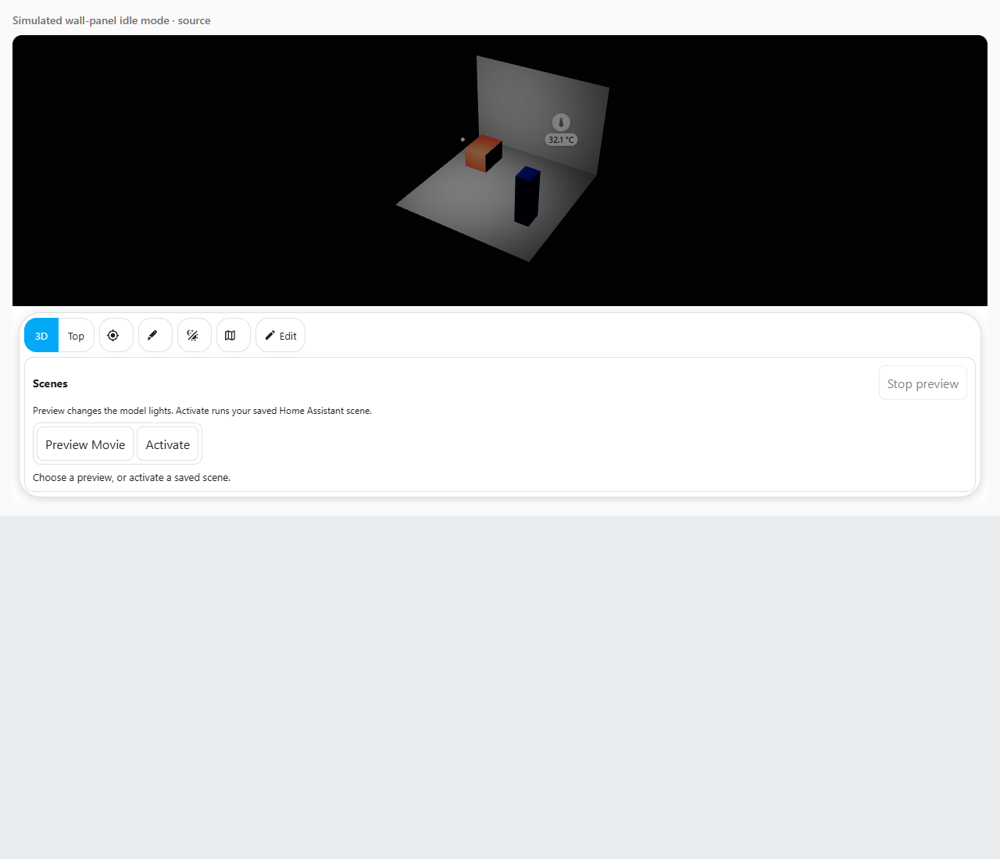

# Ambient idle mode

Development status: **Edit → Idle**, camera rotation and picture dimming are connected. All 2,508 JavaScript tests, lint/build/bundle matching and 105 dedicated source/bundle browser assertions pass. Complete project regression and GitHub checks remain. Your actual house, Home Assistant and wall panel have not been tested yet.

Idle mode makes the house picture move slowly or become dimmer after a period without interaction. It is a display effect. It does not turn real lights on or off, change a Home Assistant scene, or change your tablet's physical backlight.

This screenshot uses a deliberately simple simulated model to check picture dimming. It is not Taylor's house or a measurement of a real wall panel.

To configure it:

1. Open your Taylor's 3D card, choose **Edit**, then **Idle**. An administrator can save these shared layout settings.
2. Turn on **Enable ambient idle**. It starts off by default.
3. Set **Wait before idle mode, seconds**. For example, `120` means wait two minutes after the last interaction.
4. For a moving picture, enable **Slowly rotate the house** and choose a speed. The default is `0.5` degrees each second. `0` means no rotation.
5. For a dimmer picture, enable **Dim the card picture while idle** and choose a percentage. `65` means keep 65% picture brightness under a dim condition; `100` leaves the picture unchanged. The allowed range is 10–100%.
6. Choose **Actual sun**, **Quiet hours**, or **Actual sun or quiet hours** under **When to dim**.
7. Choose **Save idle settings** to apply the draft. **Cancel** discards the unfinished edits. Saving uses the existing layout history so **Undo** and **Redo** can restore saved choices during the editing session.

Changing fields does not begin a rotation or dimming preview. The **Currently saved** line and the unfinished draft are separate, so you can read the form without changing the picture.

**Actual sun** uses a usable current reading from Home Assistant's `sun.sun` entity. Dimming can gradually follow the reported sun elevation near dusk. An unavailable, restored or malformed reading does not become night evidence. The card's manual **Day/Night** button and light/dark theme do not replace the sun reading.

**Quiet hours** uses Home Assistant's configured time zone and the current clock. Enter exact 24-hour times such as `22:00` and `07:00`. This range crosses midnight: it starts at 22:00 and finishes at 07:00. The start is included and the end is excluded. Start and end must differ. Equal times do not mean all day.

The form shows which source is usable now. If Home Assistant has no valid time zone, the form reports it rather than using your browser's zone. A missing source can be repaired later without losing a valid saved configuration. With **Actual sun or quiet hours**, valid quiet-hours evidence can still request dimming while the sun is unavailable; the form shows both the usable condition and the missing-source warning. This check describes what would happen after the idle delay. It does not apply the effect while you edit.

Touching or moving the pointer over the card, using its keyboard controls or scrolling stops idle and restores the camera from before rotation. The first tap on a rotating surface only wakes it: use a fresh tap to select a room or device. Toolbar buttons can wake the picture and perform their usual action. A held touch or key keeps idle paused until release, then the full delay starts again.

Alerts, device panels, scene previews, automatic camera flights and editing take priority. Hidden or inactive views pause idle effects. A reduced-motion preference pauses both idle rotation and idle picture dimming. The dedicated browser run verifies these lifecycle effects; complete project and actual household checks remain. Slow rotation is still animation; this feature does not promise a particular frame rate, lower battery use or a physical panel sleep mode. For a still picture, turn **Slowly rotate the house** off; picture dimming can be used on its own.

If the saved layout, model or user changes while you are editing, the form keeps your draft and blocks **Save**. Choose **Cancel** to load the latest settings before making another change. This prevents an old draft from overwriting a replacement model or another person's saved settings. Unrelated Home Assistant readings can update the source status while the field you are typing in stays in place.

Imported settings and unfamiliar extra fields stay intact unless you deliberately edit or replace them. Invalid imported values are shown as problems and cannot be saved accidentally. **Use default idle settings** deliberately replaces the known idle fields with safe defaults while keeping unfamiliar extra fields. Defaults leave idle mode and dimming off. **Cancel** keeps the original imported settings.

The settings will use the layout's existing storage route. Shared storage makes the saved choice available to other cards using the same layout key; local fallback storage follows the existing limitations shown in **Data**. No separate idle-mode timer, renderer or device automation is created by this settings editor.
