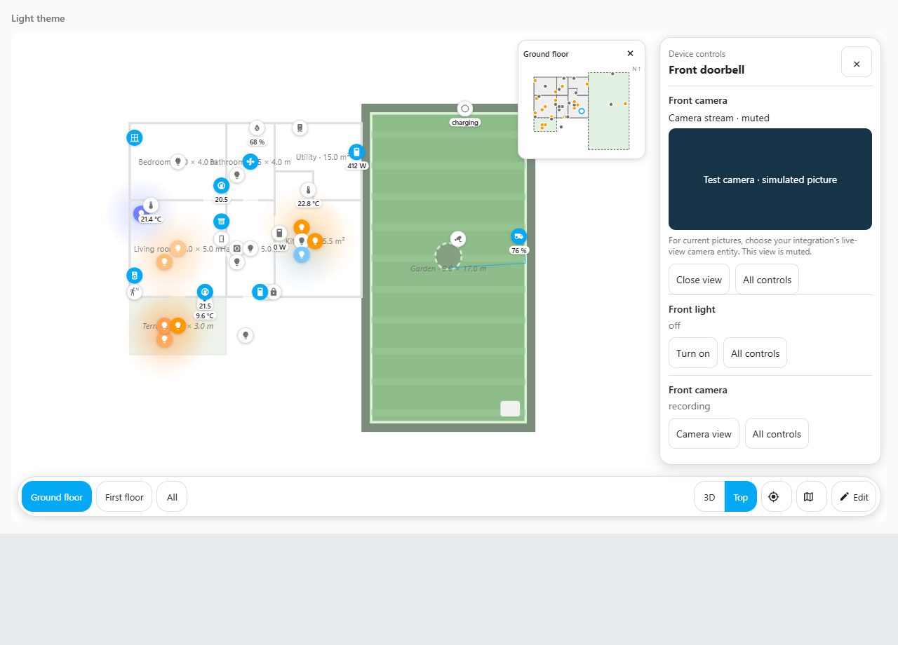
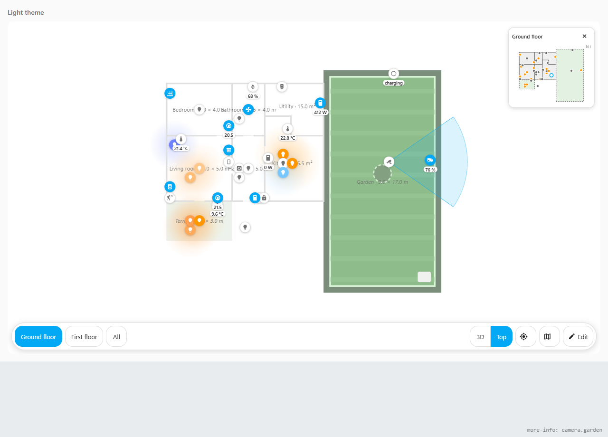

# Cameras in Taylor's 3D

You can open a camera picture from the house and add shaded coverage to show roughly
where the camera points. These are separate settings: the picture comes from your
Home Assistant camera integration, while coverage is a drawing you configure.

A saved camera preset, such as **Front door**, changes your viewpoint of the 3D house.
**Camera view** opens pictures from a physical camera.

This example uses a clearly labelled simulated picture for browser testing. It is not
Taylor's Ring feed.

## Open a camera view

First check that the camera works in Home Assistant's own controls. An **entity** is
Home Assistant's name for one reading or control; camera entities start with `camera.`.
If the integration offers several camera entities, choose its live-view entity for
current pictures. An entity for the last recording may show a recording here too.

Use the card's normal **Open device controls** tap option. Find it in the card's visual
configuration under **Navigation and device controls → When you tap a device**.

1. Tap a camera marker, or a model object linked to a camera. Its view opens in the
   controls panel.
2. If the camera shares a device with a light or other controls, tap **Camera view**
   beside the camera's name. Room panels also offer this button; opening a room starts
   no camera feed by itself.
3. Use **Close view** to stop this viewer and keep the device panel open. Use **×**,
   Escape, or a tap outside the panel to close both.
4. **All controls** closes this viewer and opens Home Assistant's own controls for
   the selected entity.

Opening a camera view sends no command to toggle a light, switch or camera. The viewer
uses Home Assistant's native camera card and your existing Home Assistant connection.
It is muted; Taylor's 3D does not provide an audio switch in this view.

**Camera stream** means Home Assistant advertises a supported streaming format.
**Camera view / preview** lets Home Assistant choose its fallback picture. These
labels do not prove that the source is live. An empty streaming-format list can still
allow Home Assistant's [MJPEG fallback](https://github.com/home-assistant/frontend/blob/dev/src/components/ha-camera-stream.ts).
Home Assistant handles the actual playback and any
player errors. See its [native picture card](https://github.com/home-assistant/frontend/blob/dev/src/panels/lovelace/cards/hui-picture-entity-card.ts)
and [camera image component](https://github.com/home-assistant/frontend/blob/dev/src/panels/lovelace/components/hui-image.ts).

If the camera disappears, becomes unavailable or loses its Home Assistant connection,
Taylor's 3D removes the viewer. After recovery, choose **Retry** or **Camera view** to
open it again. Other Home Assistant camera cards and preload settings are independent
of this viewer.

## Draw approximate camera coverage

Sign in as an administrator to edit the layout. Give the camera a real position first:
use **Edit → Devices** for its marker, or **Edit → Objects** to link a suitable model
object to its camera entity. Coverage follows that existing position and floor.
The Cameras form does not place the camera or guess where it is mounted.

1. Open **Edit → Cameras** and select your **Camera**.
2. Choose **Camera object or marker**. Its floor appears in the choice and below the
   direction diagram. If the same camera has several model objects, choose the one
   you intend to configure.
3. Tick **Show approximate coverage**.
4. Enter the direction, width and distance using the fields below. Watch the preview
   on the house and the compass diagram as you adjust them.
5. Press **Save**. This saves coverage with the layout. **Undo** and **Redo** can recover
   saved changes. **Cancel**, changing camera, or leaving the tab discards the draft.

| Field | What it means |
| --- | --- |
| **Heading, degrees clockwise from north** | Direction the camera points: 0° north, 90° east, 180° south, 270° west. The heading slider lets you turn it visually. |
| **Horizontal field of view, degrees** | How wide the shaded fan is, from 1° to 175°. Use the camera's horizontal lens specification when available. |
| **Approximate range, metres** | How far the fan extends across the plan, from 0.1 to 100 metres. Check that your house model uses the correct scale. |
| **Coverage colour** | A colour code such as `#03a9f4` for blue. |
| **Opacity, 0 to 1** | Strength of the shading. A low value, such as 0.14, keeps the house visible; 0 hides coverage. |
| **Show camera boundary rays** | Draws lines from the camera to the edges of the illustrated coverage. |

A blank heading is unconfigured, even if the untouched slider rests at zero. Enabling
coverage requires valid direction, width, range and a mapped position. Correct any
message in the form before saving. **Clear saved coverage** removes this camera's
saved coverage setting and is also undoable.

For example, an east-facing driveway camera with a 90° horizontal field of view and
an estimated eight-metre reach would use heading `90`, field of view `90`, and range
`8`. Compare the result with the camera's actual picture before relying on your layout.

## What coverage can tell you

The shaded fan is an approximate horizontal area on the floor. It follows your saved
camera position and the visible floor; changing the mapped position moves the drawing.
Walls, obstacles, lens distortion, vertical tilt and detection zones are not calculated.
The rays do not turn it into a measured detection volume.

Coverage does not prove that the camera is online or detecting anything. A saved fan
may remain visible while the camera is unavailable. It does not add car, person or
motion detection; those features need actual detection entities from your camera or
another Home Assistant integration.

If no camera position is available, check its room mapping or model-object binding.
If a saved camera or object has been removed, its existing choice is kept so you can
repair the mapping or clear it. A hidden camera object or hidden floor will not show
its coverage. Editing these settings opens no camera stream and sends no device command.
