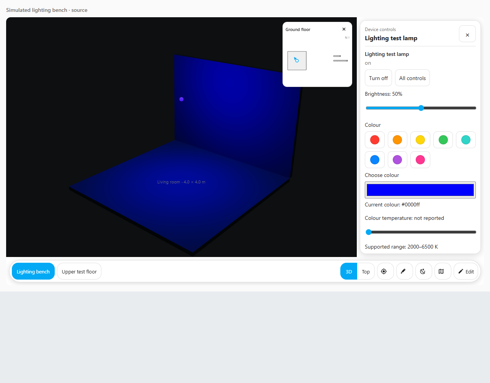

# Lights and colour in Taylor's 3D

Tap a light or open its room panel. The panel reads Home Assistant's latest state.
Opening it does not switch anything on. The available controls depend on what that
particular light supports: brightness, colour, or warm/cool white. **All controls**
still opens Home Assistant's own full controls.

This screenshot uses a test model and simulated Home Assistant readings. It shows
the controls and surface lighting; your house materials and lamp positions determine
how your own model looks.

Choosing a colour or releasing a brightness/white-temperature slider sends a command
to the real light. The house follows the state Home Assistant reports afterwards;
it does not pretend that a command has succeeded. A failed command stays visible in
the panel so you can retry deliberately.

## Make a model lamp light the room

1. Upload your house GLB and open **Edit**.
2. Select its lamp and bind it to the exact Home Assistant light entity. A model can
   also contain an explicit entity suggestion. Check that it points to your light.
3. Use a model object tagged as a light, with an authored light anchor or glow mesh.
   A glow mesh is the visible bulb; the light anchor is where illumination starts.
4. Try Night so daylight does not hide the change. Set red, then blue, and change
   brightness. Nearby walls and floor should respond as well as the bulb.

Walls and floors need materials that respond to lighting. A model's deliberately
unlit materials or baked colours can look different. Lamp position, room geometry,
exposure and physical light settings also affect the result. The card does not
infer a lamp's physical wattage from Home Assistant's brightness value.

For drawn rooms without a GLB, the card shows a coloured floor glow at the light's
marker. It is a visual indication, rather than a physical lighting simulation.
Both this glow and model lamps read the same validated colour/brightness values.

## Warm and cool white

Colour temperature is measured in **Kelvin**. Lower values look warmer; higher
values look cooler. The white-temperature control appears only when Home Assistant
reports that support and valid minimum/maximum values for the light. It stays inside
those reported limits. A colour-only light does not receive an invented white setting.

Home Assistant normally supplies a converted RGB colour for Hue colour modes,
including XY. Taylor's 3D uses that reported colour. It does not guess an XY gamut
when the converted colour is missing. Missing, malformed, restored or unavailable
readings cannot make a model lamp appear live. An ordinary white-only or older light
can retain the existing fixed warm display colour; that is a decorative fallback,
not a measured Hue colour.

## Keep a wall panel responsive

The card reuses its existing renderer and fixed pool of **eight point lights and
four spot lights**, with at most **four shadow slots**. This limits realtime lamps,
not rooms. Off, hidden and zero-output lamps do not use an illumination slot.
Within each pool, useful current output helps choose which visible lamps get a slot.
Other valid lamps can keep their bulb glow.

Changing a lamp's colour or brightness redraws the scene. An unchanged reading,
including a new Home Assistant state object with only a changed name, should not
redraw the house or recalculate its shadows. Low-power lighting remains available
through the existing lighting mode.

## Check with your own Home Assistant

- Bind one real Hue lamp and test red, blue, warm/cool white and brightness.
- Confirm that the physical lamp responds once per intentional control action, and
  that the displayed reading follows Home Assistant's response.
- Try off, unavailable and a dashboard reload. A stale restored reading should not
  light the model.
- Hide the lamp's floor/view and check the displayed result. Try more than twelve
  lamps and the low-power lighting mode on your wall panel.
- Check both light and dark themes, the narrow panel layout and **All controls**.

Automated tests use simulated entities and a dedicated model fixture. They cannot
confirm your actual Hue integration, house materials or tablet performance.

The light state and capability handling follows Home Assistant's official
[light entity documentation](https://developers.home-assistant.io/docs/core/entity/light/)
and [light integration](https://github.com/home-assistant/core/blob/dev/homeassistant/components/light/__init__.py).
