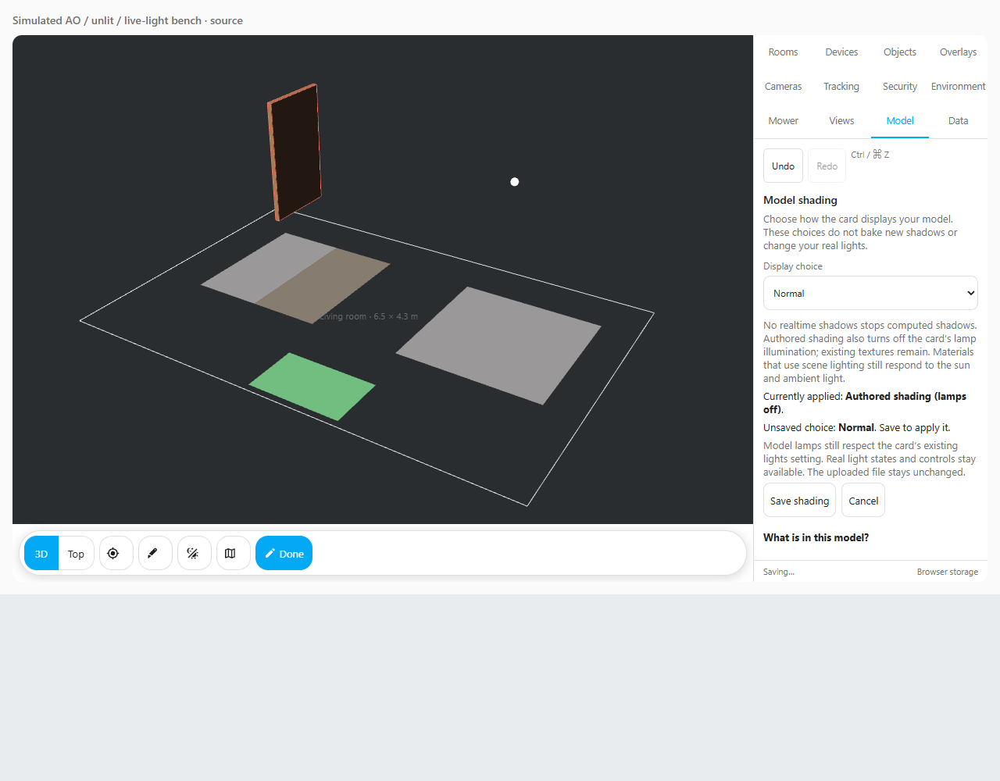
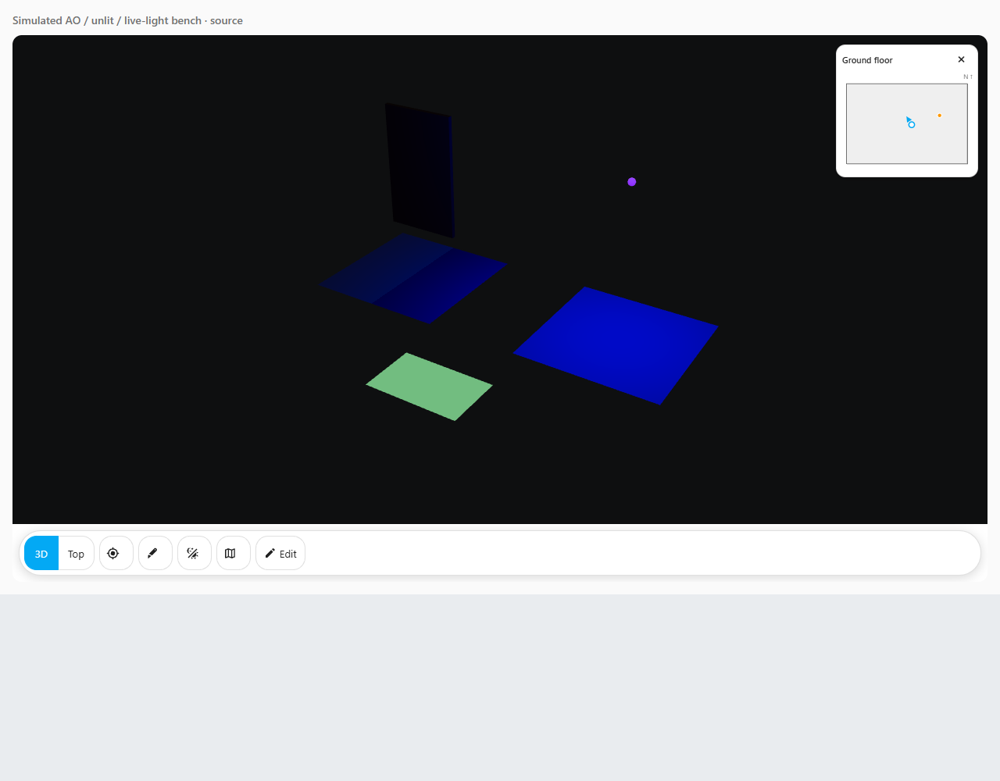

# Model shading

You can make the model cheaper to draw on a wall panel by turning off realtime shadows. You can also display shading that you have already put into the model in Blender. The card does not create baked textures or change your uploaded GLB.

1. Open your Taylor's 3D card, choose **Edit**, then **Model**.
2. Under **Model shading**, choose **Normal**, **No realtime shadows**, or **Authored shading (lamps off)**.
3. Choose **Save shading** to apply the choice. **Cancel** drops an unfinished choice. **Undo** and **Redo** restore saved shading choices during the current editing session.

| Choice | What you will see |
| --- | --- |
| Normal | Computed shadows and the card's usual model lamps. An existing `lights: off` card setting stays off. |
| No realtime shadows | Computed shadows are off. Model lamps keep following the existing card setting and current Home Assistant light readings. |
| Authored shading (lamps off) | Computed shadows and the card's model lamp illumination are off. Existing material textures remain. Materials that use scene lighting can still respond to sun and ambient light. |

These are display choices. Your actual lights stay in their real state, and their controls still work. Changing a choice and pressing Cancel sends no device command and applies no display change. The choices are available for uploaded models, models loaded through the card's YAML, and layouts with no model yet. The upload controls may still require the integration; display settings follow the layout's existing storage route.

The **What is in this model?** report inspects the loaded file's materials. It counts AO textures, unlit materials and light-map textures, and checks texture coordinates. A count is evidence that a property exists, not proof that the house has a complete lighting bake. If no model is loaded, the report says so. If another model or saved setting arrives during an unfinished edit, Cancel loads the latest settings before you save again.

This simulated bench shows an applied **Authored shading** choice with an unfinished
**Normal** choice. The picture keeps the applied setting until **Save shading**.

The left surface has AO shading; the right surface responds to the blue test lamp.
The green surface uses an unlit material, so the scene lamp does not change it.
These are small test surfaces, not a picture of Taylor's actual house.

AO means ambient occlusion: shading where nearby surfaces block ambient light, such as room corners. A glTF AO texture affects indirect ambient lighting, not direct light or moving shadows. It uses the image's red channel. [Khronos glTF material specification](https://registry.khronos.org/glTF/specs/2.0/glTF-2.0.html#_material_occlusiontexture).

To prepare an AO texture in Blender, start with a copy of your model and try one simple room first:

1. Save a backup of your original GLB and Blender project. Give the working copy a new filename.
2. Select the mesh you want to bake. Check that it has a UV map: this is the flat layout telling Blender where image pixels belong on the 3D surface. For a unique bake, unwrap the surfaces so they do not overlap unintentionally.
3. In the Shader Editor, add an **Image Texture** node and create a new image. Select that node so it is the active bake destination. Use a separate destination for each material that needs a different image. Leave the destination disconnected while baking. Blender checks the active UV layer and selected image node; save or pack the finished image. [Blender's bake implementation](https://github.com/blender/blender/blob/main/source/blender/editors/object/object_bake_api.cc).
4. Choose **Cycles** as the render engine. In Render Properties, open **Bake**, choose **Ambient Occlusion**, and bake to the image. Check the result before continuing. These controls belong to Cycles, including its image-texture output and margin settings. [Blender's Cycles Bake controls](https://github.com/blender/blender/blob/main/intern/cycles/blender/addon/ui.py).
5. Connect the finished image to **Occlusion** on a node group named **glTF Material Output**. Enable the exporter's Shader Editor add-ons to find it under **Add → Output**. This special connection tells the exporter to include AO; Blender's viewport may show AO differently. [Official Blender glTF exporter documentation](https://github.com/KhronosGroup/glTF-Blender-IO/blob/main/docs/blender_docs/scene_gltf2.rst#baked-ambient-occlusion).
6. Export as **glTF Binary (.glb)**, with materials, images and UVs included. Keep custom properties and the tagged object hierarchy used by Taylor's 3D. Avoid a selected-only export that omits rooms or objects. A GLB packages its model and textures together. [Exporter options](https://github.com/KhronosGroup/glTF-Blender-IO/blob/main/docs/blender_docs/scene_gltf2.rst#export).
7. Open the exported copy in a viewer, then load it into Taylor's 3D. Check the material report and the room corners. Try **No realtime shadows**, then **Authored shading (lamps off)**, and keep the choice that looks right on your panel.

A full lighting bake is a separate authoring task: you save a particular lighting setup into images. To avoid applying scene lighting again, an author can export an unlit material using `KHR_materials_unlit`; the exporter documents its supported node arrangement. Unlit materials are independent of scene lights. [Unlit exporter guidance](https://github.com/KhronosGroup/glTF-Blender-IO/blob/main/docs/blender_docs/scene_gltf2.rst#exporting-a-shadeless-unlit-material), [Khronos unlit specification](https://github.com/KhronosGroup/glTF/tree/main/extensions/2.0/Khronos/KHR_materials_unlit).

Baked lighting is fixed to the geometry and lighting used when it was created. A door that opens later can still have a painted closed-door shadow; changing sun direction or Hue colour cannot rewrite that image. Use realtime shadows when that movement matters, or author a subtle AO texture that does not paint a strong fixed doorway shadow. Texture size still affects memory and loading time, so test on the actual wall panel.

Before choosing **Replace model**, export your layout backup in **Data** and keep the old GLB separately. Replacing or removing a shared model resets editing history: Undo stores configuration, and cannot restore overwritten model bytes. For a YAML-loaded model, back up the old file before replacing it in `/config/www`. Preserve exact room/object tags so your saved links can still resolve; repair any missing links deliberately.
