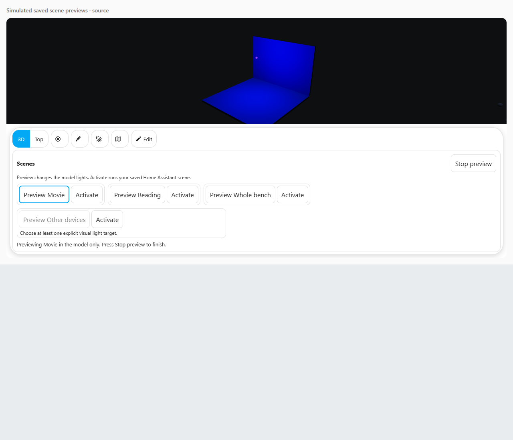

# Scene light previews

Once you have saved an enabled preview list, the bottom bubble bar shows **Scenes**.
Hover **Preview Movie** with a mouse for a temporary look; moving away restores the
latest real readings. On a touch screen or keyboard, press Preview to keep the look
until **Stop preview** or Escape. Clicking Preview with a mouse also keeps the look.
**Activate** is always a separate choice. Opening
real device controls, changing views, hiding the card or disconnecting also stops a
preview. A regular signed-in user can use saved previews; editing requires an administrator.

On a narrow panel, scroll the saved scene list to reach more choices. The heading
and **Stop preview** stay outside that list so you can stop the look easily.

A preview lets you try a lighting look on the 3D house before choosing **Activate saved scene**. Preview changes the drawing only. The actual devices and their Home Assistant readings stay as they are.

Home Assistant scenes can control several devices, including things other than lights. A scene's state reports its last activation time, or may be unknown; it does not tell this card every setting the scene will apply. This feature therefore uses light targets you choose explicitly. [Home Assistant scenes documentation](https://www.home-assistant.io/integrations/scene/).

For example, you can link **Movie** to your real Movie scene and describe a dim red lounge lamp. That is your visual description. If you later change the real Movie scene in Home Assistant, update this description too.

1. Create or choose your real scene in Home Assistant first. An entity ID such as `scene.movie` is its exact saved address. A friendly name is just its display label.
2. In Taylor's 3D, choose **Edit → Scenes**. Editing and capturing a draft require an administrator account.
3. Tick **Enable saved scene previews**, then choose **Add scene preview**. Enter a **Preview label** and choose the exact **Home Assistant scene**.
4. Under **New light target**, choose a light and press **Add light target**. Repeat for the lights you want to represent. The card does not fill this list from the scene name or invent settings.
5. Set each target's **Desired visual state** to **On** or **Off**. For a dimmable On target, enter **Preview brightness**, from 0 to 255; 255 is the maximum and 128 is roughly half the brightness setting.
6. For a colour-capable On target, choose **RGB colour** or **Colour temperature (Kelvin)**. Choose the RGB colour deliberately. The picker initially displays white, but white becomes a target only when you choose it or press **Use chosen RGB colour**. Kelvin starts blank and must stay within that particular light's reported limits. No universal warm-white temperature is assumed.
7. Choose **Save scene previews**. This saves one layout edit; it does not create or change a Home Assistant scene. **Undo** and **Redo** restore saved preview settings during the current editing session. **Cancel** drops unfinished settings.

Brightness and colour controls follow the light's actual supported capabilities. An on/off-only light has no colour setting; its visual fixture uses the card's fixed display colour. This is a display fallback, not a measured colour. Home Assistant defines the brightness range and the light's supported colour modes and Kelvin limits. [Light entity documentation](https://developers.home-assistant.io/docs/core/entity/light/).

You can use **Capture these current lights** instead of typing all the settings. It takes a snapshot of the selected lights as they are now. Off lights stay Off, without copying old colour values that may remain in their attributes. Capture does not activate a scene, move a device or read the scene's definition. If any selected reading is missing, restored, unavailable or incomplete, capture stops with a message and keeps the draft unchanged. You can then fix the source or choose targets manually when its supported controls are available.

Save the enabled setting before using **Preview draft lights**. You can then adjust a saved mapping and try the unfinished draft locally. **Stop preview** or Escape removes the draft preview. Changing its fields, leaving Scenes, cancelling, disconnecting or changing the layout/model also removes it. The drawing returns to the latest real readings, including updates that arrived while you were previewing. The **Reported Home Assistant state (not preview)** text always describes the actual source.

**Activate saved scene** is the separate action that controls real devices. It uses the enabled, saved scene link, even if an unfinished light preview is incomplete. It cannot activate a scene you have only selected in an unsaved draft. It may also operate non-light devices in that real scene, which the lighting preview cannot show. A current authenticated user can activate a saved scene; Home Assistant still decides whether that user has permission.

While activation is pending, the button prevents duplicate requests. A permission or connection error is displayed, with no automatic retry. A success message means Home Assistant accepted the action; it does not prove every lamp has reached the preview targets. Check the real readings.

Keep missing saved links until you deliberately repair them. Restore the exact entity, choose its replacement, or remove the target. The card does not guess that a similarly named light is the same device. If saved settings, the model or the editing context changes during a draft, **Cancel** loads the latest version before you save again. Unfamiliar imported fields are retained; malformed settings require a deliberate **Start a new preview list** to replace them.

The lighting preview is an approximation of the 3D appearance. A lamp needs a mapped model fixture to illuminate nearby model surfaces, and existing model-lamp display settings still apply. Authored baked lighting stays fixed. These light targets do not simulate energy use, security events or people's locations, and saving a preview does not change those sources.

This screenshot uses a simulated test model and simulated Home Assistant readings:

