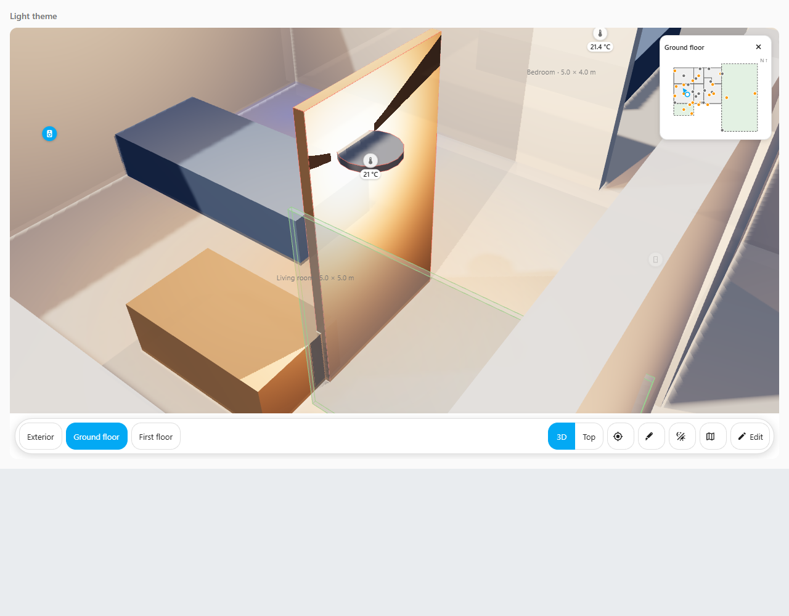
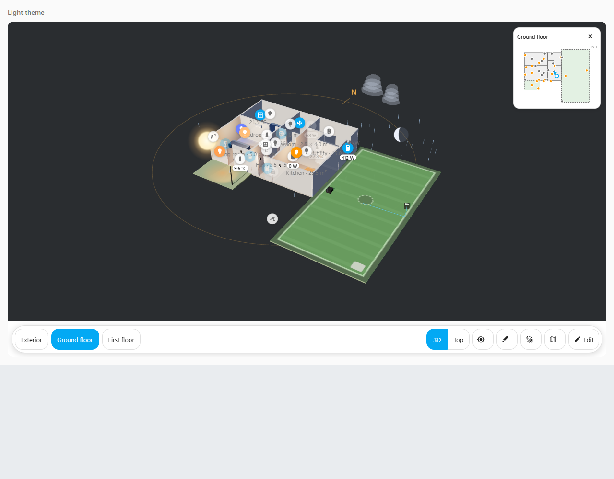

# Door, window and outdoor weather views

These are optional display features. Configure them in the house's **Edit** panel. Saving changes the layout and gives you one Undo step; it does not operate a device.

## Security contacts

1. Open **Edit → Security → Add security binding**.
2. Choose the actual Home Assistant door/window contact and the exact tagged object in your GLB. Ordinary node names alone are not a reliable object link.
3. Set the states that mean open and closed. **Use HA contact states** deliberately sets `on` to open and `off` to closed, which is usual for HA contacts. Check your real entity first.
4. Choose the outline colours. Open defaults to red. A closed outline is optional; an unknown reading uses grey.
5. Save, then open and close the physical contact and compare it with the display.

A general motion sensor or a lock state cannot prove a door is open. An unclassified binary sensor needs your explicit confirmation that it is a real contact. Missing, disabled, restored, unknown or unavailable readings cannot confidently report open or closed. Opening the form only previews the evidence as text.

### Plan locations and locks in the local test candidate

The combined local candidate also supports security indicators without a tagged
model part. Its complete browser and household checks are still pending.

In **Edit → Security**, choose a contact or **Lock**, then choose a **Plan** target.
Place it using an exact room, an existing marker anchor, or fixed plan coordinates
on the selected floor. Coordinates describe the original house; visual floor
separation is applied afterwards. A missing room, marker or floor stays missing
until you deliberately repair the saved link.

An open contact or unlocked lock gets its configured highlight. Locked/closed
clears it by default. Locking, unlocking and jammed remain distinct uncertain
states; unlocking cannot prove a door is physically open. Plan indicators do not
animate a GLB door. Tapping an indicator or its mini-map symbol opens the current
source's controls without sending a device command.

Optional source-age rules use an actual reading timestamp. A sensor remaining
closed for hours does not by itself mean the sensor stopped reporting. Only use
an age rule when you know which timestamp your integration actually supplies.

### Animate a door

The GLB must have a separate, rigid moving leaf or hinge group. A door baked into a single wall mesh cannot be animated independently.

Enable the motion option and choose its exact relative moving-part path. Supply the hinge pivot and axis in that part's **parent-local model coordinates**. For a conventional vertical hinge, the axis may be `[0, 1, 0]`, but use the actual model axis rather than assuming it. Set signed closed/open angle offsets from the model's authored pose and a duration in milliseconds.

These angles are a visual representation of contact states. A binary contact does not measure how far the real door has opened. The card rejects ambiguous, deforming, sheared or already driven targets rather than applying competing animations. It preserves the original hierarchy and materials, and restores the authored pose when the binding/model is removed. Reduced-motion preferences snap the visual change.

As a configured leaf moves, its attached devices and lights follow it. Picking, visibility and shadow caches refresh in the existing renderer. Clipping still follows the selected floor/Section. An uncertain reading returns the authored pose with an uncertain outline; that pose does not assert that the real door is closed.

This browser fixture shows an explicitly configured open door outlined in red and a closed window outlined in green. The lamp and attached temperature marker follow the moving leaf. It demonstrates the display behaviour; it is not Taylor's actual house or a measured real door angle.

## Sun and weather

**Auto** on the Day/Night bubble uses genuine numeric angles from `sun.sun`. Set north/alignment correctly in your model so the shadow direction matches your home. Home Assistant's actual latitude/longitude supplies the moon calculation. If this evidence is missing or invalid, the card uses its neutral fallback and reports the missing evidence. Manual Day and Night still work.

To add decorative outdoor weather:

1. In **Rooms**, provide complete indoor outlines and mark your garden/driveway outlines **Outdoor**. Tagged model rooms/zones use their existing outline definitions.
2. Open **Edit → Environment**. Enable weather and choose your actual `weather.*` entity.
3. Choose rain, snow and/or clouds. Select **Static** for a still effect, or **Low** for fewer animated particles on a wall panel.
4. Set decorative intensity and save. It controls the visual density, rather than a measured precipitation rate.

The effect follows the entity's current condition. A forecast alone does not mean it is raining now. The card avoids every indoor footprint, including hidden floors. This conservative rule can also exclude a balcony above an indoor room. Broken indoor links or outlines stop precipitation until repaired; the card cannot infer your building's roof volume from a bounding box.

Weather pauses while editing, in Section view, when the browser tab/card is hidden and when disconnected. Reduced-motion settings stop animation. Static or cloud-only effects stay idle. Repeated readings reuse particles; animated rain and snow redraw only while the effect is visible. The effect uses bounded geometry in the same scene with no extra realtime lights, shadow casters or external weather assets.

This test uses simulated current conditions and tagged indoor/outdoor outlines. Rain stays outside the indoor footprints. It illustrates the effect and does not claim to measure the weather at Taylor's home.

## Check at home

- Verify the contact's real open/closed values, missing-data appearance and the exact GLB leaf before relying on its outline or motion.
- Try Save, Undo, Redo, Cancel and reload. Repair a missing entity/object deliberately; an unrelated replacement must never be selected automatically.
- Check the actual sun direction and your current weather source. Compare precipitation with indoor boundaries on each floor.
- Try the real wall panel, narrow layout, night theme and reduced-motion setting. Turn weather off if the panel needs less visual activity.

Automated checks use simulated Home Assistant readings and fixture geometry. They do not validate your own sensors, camera services, house model or tablet performance.
