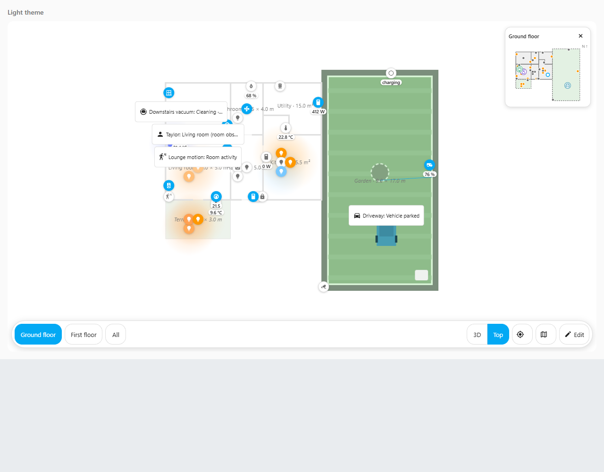
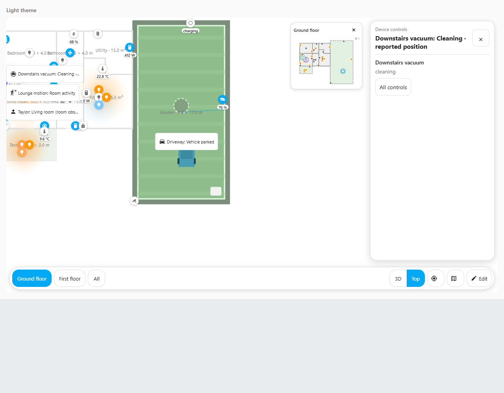

# People, driveway vehicles and robot vacuums

Open the house's **Edit → Tracking** tab. Choose **Presence**, **Driveway vehicles** or **Robot vacuums**, then add a binding. A binding connects a real Home Assistant reading to a display location in your house. **Save** records that connection; **Cancel** discards the draft. **Undo** and **Redo** also work for saved tracking changes.

These controls change the layout. They do not start a vacuum or operate another device. Tapping a displayed symbol or its mini-map entry opens the usual device panel; use a device action deliberately when you want to control it.

The example house uses simulated readings for testing. Labels retain their full descriptions for keyboard and screen-reader users; nearby buttons move apart on screen while their actual house positions stay unchanged.

## Presence

For a Hue motion sensor, choose **Anonymous room activity**, select the actual sensor, set its active/clear states and select the room. The symbol means that the sensor reports activity there. It cannot tell you which person moved.

For a source that reports a person's room, choose **Reported room location**. Map each exact reported value to its room outline. For example, if your source reports `Lounge`, map that value to your Lounge room. You can associate the reading with the actual person or device entity. A phone reporting only `home` or `not_home` cannot place that person in a particular room.

If two readings place the same person in different rooms, the card reports the conflict rather than choosing a room. Matching readings share one symbol. Missing, hidden, disabled, diagnostic/configuration or unavailable sources do not create a confident room location.

Home Assistant can restore a saved reading before its source reconnects. A restored reading is labelled **Stored source reading** and does not count as a current observation. You can keep or save the configuration while waiting. For other readings, **Current HA state — age unverified** means the source has not supplied a configured freshness timestamp. It does not promise that the sensor has just reported. Saved configuration can declare an actual heartbeat/timestamp and maximum age; stale evidence then clears at that deadline without waiting for another update. This first editor does not yet have controls for those advanced freshness rules.

## Cars on the drive

Use a source that actually reports vehicles in the driveway zone. A camera picture or a general motion sensor does not provide that information by itself. Select the source and confirm what it reports, then choose a driveway room, a fixed position on the plan or an existing mapped object/marker.

| Observation type | What appears | What clears it |
|---|---|---|
| Vehicle stays while occupied | A vehicle while the source reports the configured occupied state | The source reports empty; unavailable data becomes a grey status |
| Reported vehicle count | A vehicle symbol labelled with the reported count, at your chosen location | A count of zero; invalid/unavailable data is labelled |
| Vehicle seen recently — expires | A labelled recent sighting | Its configured expiry, even when no new HA update arrives |

A car parked overnight should stay visible if a maintained occupancy source still reports it. An old `last_changed` value does not mean the car has left. A one-time sighting cannot prove that the vehicle is still parked, so that mode has an expiry and says **seen recently**.

For sightings, select the actual event timestamp and its format. ISO timestamps need a timezone. Use accepted event types if the source also reports other detections. Replaying the same timestamp, reconnecting the card or receiving an unrelated sensor update does not extend the original sighting. A newer accepted vehicle event can start a new sighting. Count mode needs a whole, nonnegative count in the entity's state.

The default vehicle is anonymous. A named vehicle also needs a separate available identity reading that matches the exact identifier you configure. A display label alone does not identify its owner. Counts do not invent individual parking bays; choose actual positions deliberately.

## Robot vacuums

Select the real vacuum entity and one of these modes:

- **Status at a fixed room or dock:** displays its real cleaning/docked/idle status at your chosen location. It stays still because status alone does not provide coordinates.
- **Reported room, exact position unknown:** map exact room readings to room outlines. The room symbol is an observation of the room, rather than the vacuum's precise position within it.
- **Measured X/Y position in plan metres:** select the real coordinate source, its X and Y attribute paths and the actual floor. Confirm that those values already match your house plan's metre coordinates.

Each vacuum has its own binding and symbol. Coordinate updates move only that vacuum. In Room or X/Y mode, choose a **Fallback display location** too. Missing, restored, stale or invalid coordinates use that location with a clear status label. A marker at the dock is a chosen place to show status; it does not prove the robot is physically there. The card does not invent a cleaning route from the word `cleaning`.

Status and coordinate readings have separate freshness rules in saved configuration. A fresh position can still be displayed when the cleaning status is stale; its grey label explains the stale status and it stops smoothing between positions. Fresh status with stale coordinates remains labelled at the chosen fallback. Each declared deadline is checked even without another HA update.

The source reader also supports validated coordinate calibration and GPS mappings in saved configuration. This first visual form edits direct plan-metre X/Y sources; imported calibrated mappings remain preserved and read-only. **Relink deliberately** starts a new direct-plan X/Y draft; it does not recalibrate the imported map. **Cancel** keeps the saved mapping. A visual calibration workflow is still needed before arbitrary vacuum map coordinates can be configured entirely in the card.

## Locations and missing links

A room needs a valid outline and a mapped floor. A fixed position uses X/Y in metres plus height relative to its chosen floor. An object/marker choice refers to that exact mapped placement. Changing views hides symbols on other floors; it does not move their saved locations.

If a saved entity, floor, room or object disappears, the form keeps its original reference. Restore it, choose **Relink deliberately** and repair it, or **Clear saved binding**. An unrelated replacement is never selected automatically.

Static people/vehicle/status symbols reuse the existing renderer. Event expiry uses one nearest-deadline timer; unchanged readings do not require continuous house redraws. Optional vacuum smoothing only joins actual reported positions and respects reduced motion.

## Check in your Home Assistant

1. Connect one actual motion sensor to its room. Trigger and clear it; confirm the symbol is labelled as activity, without naming a person.
2. For named presence, verify the room source itself in HA first. Compare its values with the mapped room, including away and conflicting readings.
3. Connect a driveway vehicle source. Check arrival, a vehicle remaining parked, departure and unavailable data. For event mode, check expiry without another update and make sure the same old event does not bring the vehicle back.
4. Check the vacuum's status at its dock. If it supplies usable coordinates, compare several measured positions with the real house before trusting the moving symbol.
5. Change floors, tap symbols and use the mini-map. Check that the correct device panel opens and simply viewing it sends no device action.
6. Save a change, Undo, Redo and reload. Check the chosen sources and locations persist. Try the forms and panels on the actual wall panel.

The automated preview uses simulated readings. These checks with your own entities and house model are still required before marking the features Done in the feature log.
