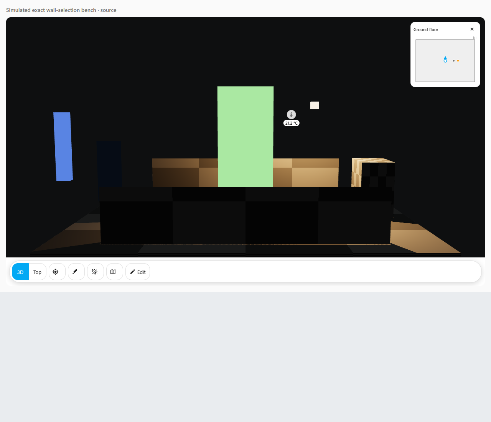

# Seeing inside your model

This is the guide for the Phase 10 wall-presentation implementation. The Model-tab editor and renderer pass all 141 dedicated browser checks against both source and bundle. The complete checkpoint regression and GitHub checks are being recorded separately. Your own model and wall panel still need checking.

Wall presentation changes the house picture. It does not operate doors, windows or any Home Assistant device, and it does not rewrite your uploaded GLB file.

## Before you start

Keep a copy of your original GLB and export your saved layout from **Edit → Data**. The layout stores your selected wall links and settings. The GLB stores the actual model meshes.

A *mesh* is a separate piece of the 3D model, such as one wall panel. Choose only actual wall meshes. A single mesh containing walls, floors and furniture cannot be cut or faded as separate parts. Room tags, a name containing “wall”, or a whole floor are not a substitute for separate wall meshes.

If your model lacks suitable separate walls, keep using the existing **Section** view to look inside it. Separating a wall in your modelling program is a different editing job.

## Choose your walls

1. Open **Edit → Model**. Wall presentation sits alongside Model shading.
2. If original wall choices are unavailable because the card combined meshes for rendering, use **Prepare separate wall meshes**. This deliberately reloads the model with its original parts available for selection. It does not save a layout change. Cancel any unsaved wall settings before preparing.
3. Choose **Add wall**. The new saved wall ID is assigned for you; the label is the name you want to recognise later.
4. For **Cut-away**, choose the wall’s actual saved floor in **Explicit floor for this wall**. The card does not guess a floor from the mesh name or whichever floor happens to be on screen.
5. Choose **Choose wall face**, then make a short click on an exposed face of the wall in the model. Moving the camera with an orbit drag does not select a face. The click records that exact mesh and its local face point and direction.
6. Add other walls individually. Floors, furniture and doors remain outside the selection unless you explicitly choose their meshes.

The captured face uses the mesh’s own coordinates. This lets the renderer use its actual position and alignment rather than guessing where a wall ought to be. The chosen face direction defines the camera side.

Press **Escape** or **Cancel surface selection** to stop waiting for a click without losing the rest of your draft. If the model, alignment or saved floor data changes, the old pick is cancelled. A camera-view or displayed-floor change also stops a pending selection.

## Pick the appearance

- **Normal** keeps the authored appearance. Turning **Enable wall presentation** off also disables the effect.
- **Fade** makes the chosen walls more transparent, using your **Fade or glass opacity** value. `20%` means mostly transparent; `100%` keeps the selected wall’s normal opacity.
- **Cut-away** hides the selected wall above **Cut-away height above the chosen floor**. The height is in plan metres, measured from that explicitly chosen floor. It does not cut every object on the floor.
- **Glass look** uses transparency to suggest glass. It does not add physical glass, reflection, transmission or refraction to the material.

**Camera side** changes a selected wall when the camera is on the side defined by its captured face. It needs a real selected face for every wall row. **All selected walls** applies the choice statically to every enabled selected wall; you can select an exact mesh from **Exact wall mesh** without capturing a face in this mode.

**Fade transition** controls the transparency transition from `0` to `1000` milliseconds. `0` means immediate. Reduced-motion mode must use immediate changes instead of animated fading.

The inputs describe your draft. They do not change the picture before Save.

## Save, cancel and repair

Use **Save wall settings** when the choices are complete. This saves one layout change, so **Undo** and **Redo** can restore the previous settings. **Cancel** discards your unsaved choices. Leaving the Model tab or closing the editor also discards its draft and pending pick.

Preparation temporarily exposes separate meshes. Finishing or cancelling that editing work lets the card restore its configured merging while preserving the exact saved wall paths.

If a selected mesh or floor is missing, its saved reference stays visible. You can:

- Turn **Enable this wall** off while keeping the reference.
- Use **Relink wall** to deliberately choose a replacement mesh or repair the floor.
- Use **Remove wall** to remove that saved selection.

A different replacement mesh clears the previous mesh’s face and floor; choose the new ones explicitly. The card does not match a missing wall to another wall with a similar name. If the saved settings or model change while you have a draft, the draft is kept for you to inspect, but Save is blocked until you Cancel and load the latest settings.

Malformed imported settings remain visible rather than being silently rewritten. **Use default display values (keep wall rows)** repairs the display values while retaining the saved rows. An invalid wall list or row needs its separate clear/remove action. Existing unknown extension fields stay intact when you edit ordinary supported values.

## Model limitations

Transparency is sensitive to how a model is built. Overlapping transparent surfaces can sort differently as you move the camera, and one large mesh may overlap itself. This feature does not rebuild its triangles or repair its materials. Leave already authored glass unselected unless you intend to change its appearance too.

Meshes already merged into a combined piece, instanced or skinned meshes, morphing geometry, custom shaders and meshes with another live appearance owner may be unavailable. Preparation can recover original mesh choices before merging; it cannot turn one authored combined wall-and-floor mesh into two independent parts.

Cut-away needs one current floor with a finite elevation. A missing or invalid floor is not replaced with a guessed elevation. Dedicated browser checks verify that Section and floor clipping compose with the saved wall effect, and that only the visible part blocks picking.

This is a simulated test model, not Taylor's house. Its selected foreground wall keeps the lower part while exposing the interior above the chosen cut height.

This feature is a view of the model, not a measurement of your real house. Inspect the result from several angles before relying on it for a wall panel.
